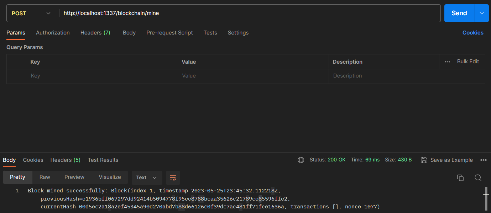
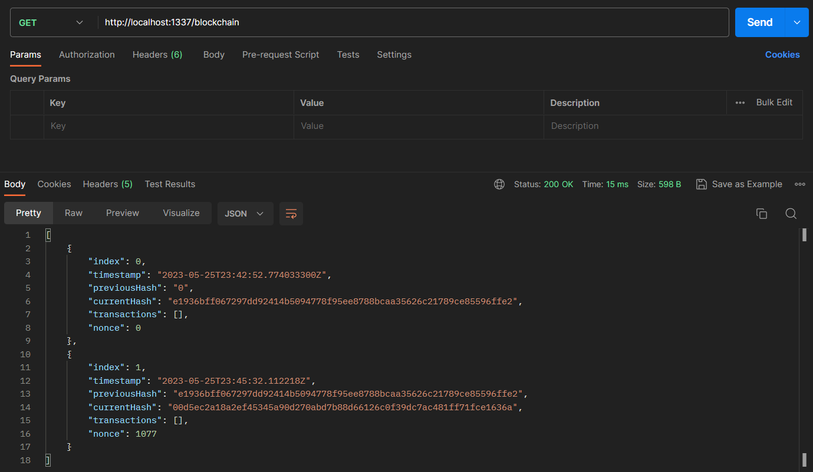
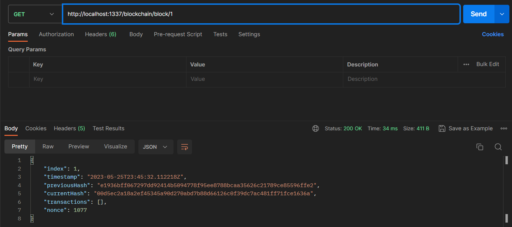
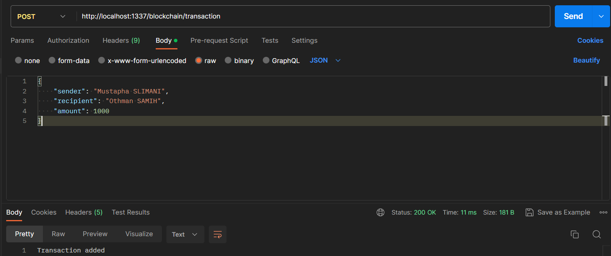
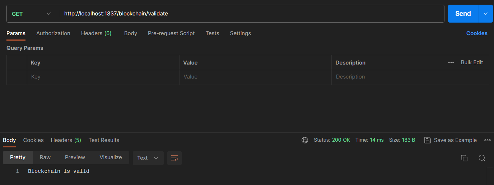

# ⛓ Blockchain Workshop
## Under development... 🚀 

# 📚 Table of Contents
- [📝 Overview](#-overview)
- [📁 Project Structure](#-project-structure)
- [✅ Testing](#-testing)

# 📝 Overview
This is a workshop to learn the basics of blockchain technology and how to create a simple blockchain using Java and Spring Boot. 

# 📁 Project Structure
```
.
│
├───assets
├───src
│   ├───main
│   │   ├───java
│   │   │   └───com
│   │   │       └───mustaphaslimani
│   │   │           └───workshop
│   │   │               │   WorkshopApplication.java
│   │   │               │
│   │   │               ├───configuration
│   │   │               │       BlockchainConfig.java
│   │   │               │
│   │   │               ├───controller
│   │   │               │       BlockchainController.java
│   │   │               │
│   │   │               ├───entity
│   │   │               │       Block.java
│   │   │               │       Blockchain.java
│   │   │               │       Transaction.java
│   │   │               │       TransactionPool.java
│   │   │               │
│   │   │               └───helper
│   │   │                       HashUtils.java
│   │   │
│   │   └───resources
│   │       │   application.properties
```

# ✅ Testing
To test the blockchain, you can use Postman or any other API testing tool.

### 1. Mine a new block
Mine new block by requesting the endpoint `http://localhost:1337/blockchain/mine` with a POST request.


### 2. Get the blockchain
Get the blockchain by requesting the endpoint `http://localhost:1337/blockchain` with a GET request.


### 3. Get Block by index
Get a block by index by requesting the endpoint `http://localhost:1337/blockchain/{index}` with a GET request.


### 4. Add a new transaction
Add a new transaction by requesting the endpoint `http://localhost:1337/blockchain/transaction` with a POST request.

You may need to specify the 'content-type' header as 'application/json' and the body as 'raw' with the following JSON format:
```json
{
    "sender": "sender-address",
    "recipient": "recipient-address",
    "amount": 10
}
```


### 5. Get the transaction pool
Get the transaction pool by requesting the endpoint `http://localhost:1337/blockchain/transaction-pool` with a GET request.


### 6. Validate the blockchain
Validate the blockchain by requesting the endpoint `http://localhost:1337/blockchain/validate` with a GET request.


